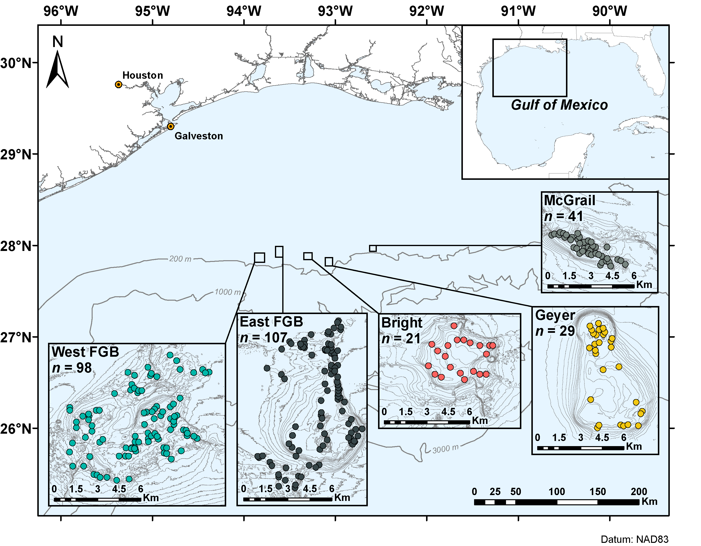

```{r, setup, include = FALSE}
knitr::opts_chunk$set(warning = FALSE, fig.align = 'left')
knitr::opts_knit$set(root.dir = '../data')
options(width = 88)
library(magrittr)
```

#### version: `r Sys.Date() %>% format(format="%B %d, %Y")`

[](https://doi.org/10.5281/zenodo.XXXXXX)

#### [GitHub repository](https://github.com/RyanEckert/NWGOM_ROV_2010_2015.git){target="_blank"}

# About this document
***
#### All analyses preformed with R version `r getRversion()`.
This is the code that accompanies the publication [XXX](){target="_blank"}. Here you will find all the code to repeat the statistical analyses performed for this manuscript. All of the accompanying data can be found on [GitHub](https://github.com/RyanEckert/NWGOM_ROV_2010_2015/tree/master/data){target="_blank"}.  

For this project we conducted 296 ROV transects (~0.1 km length) in mesophotic coral ecosystems (MCEs) across 5 banks in the nortwestern Gulf of Mexico (NW GOM). Downward-facting still photographs including scaled parallel laser points were captured along each transect. These photographs were analyzed for benthic percent cover using 50 randomly placed point per photograph.<br> 

If no biota were present under a particular point, the benthos was characterized as soft or hard bottom. Biota were identified to the lowest taxonomic level possible, given the image quality. Scleractinian corals were identified to species, cnidarians in the Class Alcyonacea and Order Antipatharia were identified to family level, sponges were identified to Class, and algae to Phylum. All other categories were categorized into bacterial mat, Chordata, echinoderm, hydroid, Mollusca, and Tunicata groups. Dead coral was marked as different from hard bottom substrate, and a miscellaneous category was used for unidentifiable biota. Points that could not be identified at all, such as those in shadows or sediment plumes, were labeled as “tape wand shadow” and were removed from statistical analyses.<br> 

Coral density was also calculated as individuals m^-2^ across the entire transect image aresa using the scaled lasers to calculate image sizes.<br>

 <br>

  If you download my entire accompanying github directory you should be able to re-run these analyses by following along with the code chunks in R Studio. If you download the code separtely or you are using this pipeline on your own data, you may need to change the working directory to where the associated files are housed (ie. ```setwd("~/path/to/directory/with/data")```).

# Basic setup of R environment
***

## Loading required packages
For the following analyses we will require the use of a number of different R packages. Most of these can be sourced from CRAN, but a couple need to be downloaded from GitHub or BioConducter. We can use the following code to quickly load in the packages and install any packages not previously installed in the R console.

```{r, load packages, include = TRUE, message = FALSE, warning = FALSE, results = 'hide'}
setwd("../data")

if (!require("pacman")) install.packages("pacman")
pacman::p_load("conover.test", "dendextend",  "ggdendro", "ggfortify", "multcompView","patchwork", "RColorBrewer", "Redmonder", "reshape2", "tidyverse", "vegan", "WGCNA")
pacman::p_load_gh("pmartinezarbizu/pairwiseAdonis/pairwiseAdonis")
```
<br>

## Additional settings and color palettes
We're also going to set the number of decimal places to display to 4 and create a few color palettes for our plots. ```colorRampPalette()``` creates a gradient between the colors specified (at least 2 colors are needed). By creating the object ```getPalette``` we can now call it and specify the number of colors we want to interpolate from the palettes we specify below. e.g. ```getPalette(10)``` will provide 10 hexadecimal color codes. Additionally we will make a color palette for our coral Family data where each of the four orders we are intesested in have a ramp of color in a different hue.<br>
```{r, color palettes etc.}
options("scipen" = 4)

colPal = divPal= c("#00B8AA", "#374649", "#FD625E", "#F2C811", "#788580")

getPalette = colorRampPalette(brewer.pal(8, "Dark2"))
getPalette2 = colorRampPalette(redmonder.pal(8, "qPBI"))

AL = colorRampPalette(c("#FFFFFF", getPalette2(4)[1]))(8)[3:8]
AN = colorRampPalette(c("#FFFFFF", getPalette2(4)[2]))(4)[2:4]
H = getPalette2(4)[3]
S = colorRampPalette(c("#FFFFFF", getPalette2(4)[4]))(11)[2:11]

coralPalette = c(AL,AN,H,S)

pie(rep(1,length(coralPalette)), col = coralPalette)
```
<br>

# Import data
***

## Coral count data
Import and prepare coral (Orders Scleractinia, Alcyonacea, Antipatharia, and Anthoathecata) and Scleractinian count data. These will be used for diversity metrics.<br>
```{r, Coral data, results='hide'}
coralFamCounts = read.csv("coralFamilyCounts.csv")
coralFamCounts$Bank = factor(coralFamCounts$Bank, levels(coralFamCounts$Bank)[c(5,2,1,3,4)])
coralFamCountsBank = coralFamCounts %>% group_by(Bank) %>% summarise_each(sum)

sclerSppCounts = read.csv("scleractinianSppCounts.csv")
sclerSppCounts$Bank = factor(sclerSppCounts$Bank, levels(sclerSppCounts$Bank)[c(5,2,1,3,4)])
sclerSppCountsBank = sclerSppCounts %>% group_by(Bank) %>% summarise_each(sum)
```
<br>

## Transformation of percentage and density by transect data
For our statistical analyses of transects by bank we will load in and transform the data from CPCe. We will standardize by transects and squareroot transform to deflate the influence of 0 counts which are commonly found in ecological abundance data. <br>
```{r, CPCe data, results='hide'}
mjrPerc = read.csv("nwgomMajorPerc.csv")
mjrPerc$Bank = factor(mjrPerc$Bank, levels(mjrPerc$Bank)[c(5,2,1,3,4)])
mjrPercT = mjrPerc
mjrPercT[3:ncol(mjrPerc)] = sqrt(mjrPerc[3:ncol(mjrPerc)] * 100)

mnrPerc = read.csv("nwgomMinorPerc.csv")
mnrPerc$Bank = factor(mnrPerc$Bank, levels(mnrPerc$Bank)[c(5,2,1,3,4)])
mnrPercT = mnrPerc
mnrPercT[3:ncol(mnrPerc)] = sqrt(mnrPerc[3:ncol(mnrPerc)] * 100)


mnrDens = read.csv("nwgomMinorDensity.csv")
mnrDens$Bank = factor(mnrDens$Bank, levels(mnrDens$Bank)[c(5,2,1,3,4)])
mnrDensT = mnrDens
mnrDensT[3:ncol(mnrDens)] = sqrt(decostand(mnrDens[3:ncol(mnrDens)],
                                                  "total") * 100)
```
<br>

## Calculate percent cover and coral density by bank
We can group and calculate percent cover and density by bank and then rearrange them to make it easy to plot stacked barplots by bank. To do this we will use the ```melt()``` function in ```reshape2```, which takes our "wide" data and melts it into "long" format.
```{r, bank data}
mjrPercBank = mjrPerc[2:ncol(mjrPerc)] %>% group_by(Bank) %>% summarise_each(mean) %>%melt(id= "Bank", value.name = "PercentCover", variable.name = "MajorCategory")
mjrPercBank$MajorCategory = factor(mjrPercBank$MajorCategory, levels(mjrPercBank$MajorCategory)[c(1, 2, 9, 12, 4:7, 11, 3, 14, 10, 8, 13)])

coralPercBank = read.csv("coralFamilyPercentCoverBank.csv") %>% melt(id= "Bank", value.name = "PercentCover", variable.name = "Family")

coralPercBank$Bank = factor(coralPercBank$Bank, levels(coralPercBank$Bank)[c(5,2,1,3,4)])

coralPercBank$PercentCover = (coralPercBank$PercentCover) * 100

coralDensBank = read.csv("coralFamilyDensityBank.csv", check.names = FALSE, header = TRUE) %>% melt(id = "Bank", value.name = "Density", variable.name = "Family")

coralDensBank$Bank = factor(coralDensBank$Bank, levels(coralDensBank$Bank)[c(5,2,1,3,4)])
```
Now the data are in the correct format to build stacked barplots.

# Percent cover and coral density by bank
***
First, we can examine the percent cover of major taxa/benthic category and the percent cover and density of corals by bank. We can make a series of barplots in R to see how each bank compares to the others.

## Major category percent cover
```{r, Major barplot, fig.dim = c(5, 3)}
colorCount1 = length(levels(mjrPercBank$MajorCategory))

mjrTypeA = ggplot(mjrPercBank, aes(x = Bank, y = PercentCover, fill = MajorCategory)) +
  geom_bar(stat = "identity", color = "black", size = 0.15) +
  scale_fill_manual(values = getPalette(colorCount1), name = "Major Category") +
  labs(y = "Percent Cover") +
  guides(fill = guide_legend(ncol = 2)) +
  theme_classic()

mjrType = mjrTypeA + theme(
  axis.title.x = element_blank(),
  axis.text.x = element_blank(),
  axis.title.y = element_text(color = "black", size = 8),
  axis.text.y = element_text(color = "black", size = 8),
  legend.position = "right",
  legend.justification = c(0,1),
  legend.title = element_text(color = "black", size = 8),
  legend.text = element_text(color = "black", size = 6),
  legend.key = element_blank(),
  legend.key.size = unit(0.5,"line"),
  legend.background = element_blank(),
  panel.background = element_blank(),
  panel.border = element_blank()
)

mjrType
```

<br>

## Coral Family Percent cover plot
```{r, Coral percent cover barplot, fig.dim = c(3, 3)}
coralPercA = ggplot(coralPercBank, aes(x = Bank, y = PercentCover, fill = Family)) +
  geom_bar(stat = "identity", color = "black", size = 0.15) +
  scale_fill_manual(values = coralPalette, name = "Coral Family") +
  guides(fill = guide_legend(ncol = 2)) +
  labs(y = "Percent Cover") +
  theme_classic()

coralPerc = coralPercA + theme(
  axis.title.x = element_blank(),
  axis.text.x = element_blank(),
  axis.title.y = element_text(color = "black", size = 8),
  axis.text.y = element_text(color = "black", size = 8),
  legend.position = "none",
  legend.justification = c(0,1),
  legend.title = element_text(color = "black", size = 8),
  legend.text = element_text(color = "black", size = 6),
  legend.key = element_blank(),
  legend.key.size = unit(0.5,"line"),
  legend.background = element_blank(),
  panel.background = element_blank(),
  panel.border = element_blank()
)

coralPerc
```

<br>

## Coral density bar plot
```{r, Coral density barplot, fig.dim = c(5, 3)}
mjrDensA = ggplot(coralDensBank, aes(x = Bank, y = Density, fill = Family)) +
  geom_bar(stat = "identity", color = "black", size = 0.15) +
  # scale_fill_manual(values = densPalette, name = "Cnidarian Fam") +
  scale_fill_manual(values = coralPalette, name = "Coral Family") +
  guides(fill = guide_legend(ncol = 2)) +
  labs(y = expression(paste("Density (m"^"-2",")"))) +
  theme_classic()

mjrDens = mjrDensA + theme(
  axis.title.x = element_blank(),
  axis.text.x = element_text(color = "black", size = 8, angle = 45, vjust = 1,
                             hjust = 1),
  axis.title.y = element_text(color = "black", size = 8),
  axis.text.y = element_text(color = "black", size = 8),
  legend.position = "right",
  legend.justification = c(0,1),
  legend.title = element_text(color = "black", size = 8),
  legend.text = element_text(color = "black", size = 6),
  legend.key = element_blank(),
  legend.key.size = unit(0.5,"line"),
  legend.background = element_blank(),
  panel.background = element_blank(),
  panel.border = element_blank()
)

mjrDens
```

<br>

## Group coral cover/density plots
Now that we have generated all 3 plots we can group them together with the package ```patchwork```. This uses intuitive syntax to group plots, ```|``` separates plots next to each other and ```/``` separtes plots over one another. We can also gather similar legends into one legend and place it where we want. See the ```patchwork``` [vignette](https://patchwork.data-imaginist.com/articles/patchwork.html){target='_blank'} for more details.<br>
```{r, Group point count bar plots, results = "hide", fig.show = "hide"}
barPlots = (mjrType / coralPerc / mjrDens) +
  plot_annotation(tag_level = "A") &
  theme(plot.tag = element_text(size = 10, face = "bold"),
        panel.background = element_blank(),
        panel.border = element_blank())

barPlots

ggsave("../figures/barPlots.eps", plot = barPlots, height = 12, width = 10,
       units = "cm", dpi = 300)
```
```{r, Plot barplot, echo = FALSE, fig.dim = c(3.94, 4.72)}
barPlots
```

***
<br>

# Alpha diversity metrics
***
Now we can examine the alpha diversity across different banks in the NW GOM. We can use ```vegan``` again to calculate different diversity metrics. We can then perform statistical tests to see where differences occur and create a figure to display the raw data that goes into these tests.

## Coral Family alpha diversity metrics
First we will look at coral count data down to Family. We will build a new dataframe including richness, diversity, and evenness measures for all transects as well as banks as a whole.
```{r}
coralFamRich = specnumber(coralFamCounts[,2:ncol(coralFamCounts)])
coralFamShannon = diversity(coralFamCounts[,2:ncol(coralFamCounts)],index = "shannon")
coralFamSimpson = diversity(coralFamCounts[,2:ncol(coralFamCounts)],index = "simpson")
coralFamRichBank = specnumber(coralFamCountsBank[,2:ncol(coralFamCountsBank)])
coralFamShannonBank = diversity(coralFamCountsBank[,2:ncol(coralFamCountsBank)],index = "shannon")
coralFamSimpsonBank = diversity(coralFamCountsBank[,2:ncol(coralFamCountsBank)],index = "simpson")

coralFamDiv = cbind(coralFamCounts[1],coralFamRich, coralFamShannon, coralFamSimpson)
colnames(coralFamDiv)[2:4] = c("rich", "shannon", "simpson")
coralFamDivBank = cbind(coralFamCountsBank[1], coralFamRichBank, coralFamShannonBank,
                        coralFamSimpsonBank)
colnames(coralFamDivBank)[2:4] = c("rich", "shannon", "simpson")

head(coralFamDiv)
head(coralFamDivBank)
```

### Kruskal-Wallis test on coral Family diversity measurements
We can use a Kruskal-Wallis test on our non-normally distributed data to see how each metric differs across banks for the coral Family counts.
```{r, KW coral Family}
kWFamRich = kruskal.test(coralFamDiv$rich ~ coralFamDiv$Bank)

kWFamShannon = kruskal.test(coralFamDiv$shannon ~ coralFamDiv$Bank)

kWFamSimpson = kruskal.test(coralFamDiv$simpson ~ coralFamDiv$Bank)

kWFamRich$p.value
kWFamShannon$p.value
kWFamSimpson$p.value
```
There are significant differences in coral Family Richness, Diversity, and Evenness across banks.

### Conover-Iman test for pairwise comparisons
Following significant Kruskal-Wallis tests we can use Conover-Iman tests to perform pairwise comparisons among all banks. We will correct the *p*-values for multiple comparisons using FDR correction (Benjamini–Hochberg procedure).
```{r, Conover-Iman tests}
richFamCIT = conover.test(x = coralFamDiv$rich, g = coralFamDiv$Bank, method = "bh", table = FALSE, list = TRUE, altp = TRUE)

shannonFamCIT = conover.test(x = coralFamDiv$shannon, g = coralFamDiv$Bank, method = "bh", table = FALSE, list = TRUE, altp = TRUE)

simpsonFamCIT = conover.test(x = coralFamDiv$simpson, g = coralFamDiv$Bank, method = "bh", table = FALSE, list = TRUE, altp = TRUE)
```

### Plot coral Family richness
First we can calculate group letters to represent the similarities between banks.<br>
```{r, Coral richness diff}
#set FALSE for n.s. comparisons and true for sig. comparisons
richFamDiff = ifelse(richFamCIT$altP.adjusted >= 0.05, FALSE, TRUE)

#name each comparison with the banks separated by only a dash, no space
names(richFamDiff) = richFamCIT$comparisons %>% str_replace(" - ", "-")

richFamSigLetters = multcompLetters(richFamDiff, compare="<", threshold=0.05,
                                     Letters = c(letters, LETTERS, "."), reversed = FALSE)
richFamLetters = as.data.frame(richFamSigLetters$Letters)
richFamLetters$Bank = row.names(richFamLetters)
colnames(richFamLetters)[1] = "id"

#set y for where letters will plot on y axis
richFamLetters$y = c(-0.95)

head(richFamLetters)
```

Now we can add the letters to a violin plot including all transect points and a bar behind each bank to represent the bank total.
```{r, Coral richness plot, fig.dim = c(3, 3)}
coralFamRichPlotA = ggplot(coralFamDiv, aes(x = Bank, y = rich, fill = Bank)) +
  geom_bar(data = coralFamDivBank, aes(x = Bank, y = rich, fill = Bank), stat = "identity", alpha = 0.6) +
  geom_violin(alpha = 0.5) +
  geom_point(shape = 21, color = "black",
             size = 1.5, position = position_jitterdodge(1)) +
  scale_alpha_manual(values = c(1, 1, 1, 1, 1)) +
  scale_fill_manual(values = divPal) +
  xlab("Bank") +
  ylab("Coral Family \nRichness") +
  annotate("label", label = paste("Kruskal-Wallis, p = ", round(kWFamRich$p.value, 4)),
           size = 3, x = 3, y = 19.8) +
  coord_cartesian( ylim = c(-0.79, 20)) +
  scale_y_continuous(breaks = seq(0, 20, 2))+
  geom_text(data = richFamLetters, aes(x = Bank, y = y, label = id),
            size = 4) +
  theme_classic()

coralFamRichPlot = coralFamRichPlotA +
  theme(axis.title.x = element_blank(),
        axis.text.x = element_blank(),
        axis.title.y = element_text(color = "black", size = 12),
        axis.text.y = element_text(color = "black", size = 10),
        legend.title = element_text(color = "black", size = 12),
        legend.text = element_text(color = "black", size = 10),
        panel.border = element_blank(),
        legend.position = "none"
  )

coralFamRichPlot
```

<br>

### Plot coral Family diversity
```{r, Coral divesity diff}
# set FALSE for n.s. comparisons and true for sig. comparisons
shannonFamDiff = ifelse( shannonFamCIT$altP.adjusted >= 0.05, FALSE, TRUE)

# name each comparison with the banks separated by only a dash, no space
names(shannonFamDiff) = shannonFamCIT$comparisons %>% str_replace(" - ", "-")

shannonFamSigLetters = multcompLetters(shannonFamDiff, compare="<", threshold=0.05,
                                       Letters = c(letters, LETTERS, "."), reversed = FALSE)
shannonFamLetters = as.data.frame(shannonFamSigLetters$Letters)
shannonFamLetters$Bank = row.names(shannonFamLetters)
colnames(shannonFamLetters)[1] = "id"

#set y for where letters will plot on y axis
shannonFamLetters$y = c(-0.125)

head(shannonFamLetters)
```
```{r, Coral diversity plot, fig.dim = c(3, 3)}
coralFamShannonPlotA = ggplot(coralFamDiv, aes(x = Bank, y = shannon)) +
  geom_bar(data = coralFamDivBank, aes(x = Bank, y = shannon, fill = Bank),
           stat = "identity", alpha = 0.6) +
  geom_violin(aes(fill = Bank), alpha = 0.5) +
  geom_point(aes(fill = Bank), shape = 21, color = "black",
             size = 1.5, position = position_jitterdodge(1)) +
  scale_fill_manual(values = divPal) +
  xlab("Bank") +
  ylab("Coral Family \nDiversity") +
  annotate("label", label = paste("Kruskal-Wallis, p = ", round(kWFamShannon$p.value, 4)),
           size = 3, x = 3, y = 2.48) +
  geom_text(data = shannonFamLetters, aes(x = Bank, y = y, label = id),
            size = 4) +
  scale_y_continuous(breaks = seq(0, 2.5, 0.5))+
  coord_cartesian(ylim = c(-0.105, 2.5)) +
  theme_classic()

coralFamShannonPlot = coralFamShannonPlotA +
  theme(axis.title.x = element_blank(),
        axis.text.x = element_blank(),
        axis.title.y = element_text(color = "black", size = 12),
        axis.text.y = element_text(color = "black", size = 10),
        legend.title = element_text(color = "black", size = 12),
        legend.text = element_text(color = "black", size = 10),
        panel.border = element_blank(),
        legend.position = "none"
  )

coralFamShannonPlot
```

<br>

### Plot coral Family evenness
```{r, Coral evenness diff}
# set FALSE for n.s. comparisons and true for sig. comparisons
simpsonFamDiff = ifelse(simpsonFamCIT$altP.adjusted >= 0.05, FALSE, TRUE)

# name each comparison with the banks separated by only a dash, no space
names(simpsonFamDiff) = simpsonFamCIT$comparisons %>% str_replace(" - ", "-")

simpsonFamSigLetters = multcompLetters(simpsonFamDiff, compare="<", threshold=0.05,
                                       Letters = c(letters, LETTERS, "."), reversed = FALSE)
simpsonFamLetters = as.data.frame(simpsonFamSigLetters$Letters)
simpsonFamLetters$Bank = row.names(simpsonFamLetters)
colnames(simpsonFamLetters)[1] = "id"

#set y for where letters will plot on y axis
simpsonFamLetters$y = c(-.06)

head(simpsonFamLetters)
```
```{r, Coral evenness plot, fig.dim = c(3, 3)}
coralFamSimpsonPlotA = ggplot(coralFamDiv, aes(x = Bank, y = simpson, fill = Bank)) +
  geom_bar(data = coralFamDivBank, aes(x = Bank, y = simpson), stat = "identity",
           alpha = 0.6) +
  geom_violin( alpha = 0.5) +
  geom_point(shape = 21, color = "black",
             size = 1.5, position = position_jitterdodge(1)) +
  scale_fill_manual(values = divPal) +
  xlab("Bank") +
  ylab("Coral Family \nEvenness") +
  annotate("label", label = "Kruskal-Wallis, p < 0.0001 ",
           size = 3, x = 3, y = 1.19) +
  coord_cartesian( ylim = c(-.05, 1.2)) +
  geom_text(data = simpsonFamLetters, aes(x = Bank, y = y, label = id),
            size = 4) +
  theme_classic()

coralFamSimpsonPlot = coralFamSimpsonPlotA +
  theme(axis.title.x = element_blank(),
        axis.text.x = element_blank(),
        axis.title.y = element_text(color = "black", size = 12),
        axis.text.y = element_text(color = "black", size = 10),
        legend.title = element_text(color = "black", size = 12),
        legend.text = element_text(color = "black", size = 10),
        panel.border = element_blank(),
        legend.position = "none"
  )

coralFamSimpsonPlot
```

<br>

## Scleractinina species alpha diversity metrics
```{r, Scleractinian species diversity}
sclerSppRich = specnumber(sclerSppCounts[,2:ncol(sclerSppCounts)])
sclerSppShannon = diversity(sclerSppCounts[,2:ncol(sclerSppCounts)],index = "shannon")
sclerSppSimpson = diversity(sclerSppCounts[,2:ncol(sclerSppCounts)],index = "simpson")

sclerSppRichBank = specnumber(sclerSppCountsBank[,2:ncol(sclerSppCountsBank)])
sclerSppShannonBank = diversity(sclerSppCountsBank[,2:ncol(sclerSppCountsBank)],index = "shannon")
sclerSppSimpsonBank = diversity(sclerSppCountsBank[,2:ncol(sclerSppCountsBank)],index = "simpson")

sclerSppDiv = cbind(sclerSppCounts[1],sclerSppRich, sclerSppShannon, sclerSppSimpson)
colnames(sclerSppDiv)[2:4] = c("rich", "shannon", "simpson")

sclerSppDivBank = cbind(sclerSppCountsBank[1], sclerSppRichBank, sclerSppShannonBank,
                        sclerSppSimpsonBank)
colnames(sclerSppDivBank)[2:4] = c("rich", "shannon", "simpson")

head(sclerSppDiv)
```

### Kruskal-Wallis tests for Scleractinian spp. diversity metrics
```{r, KW test scleratinians}
kWSclerSppRich = kruskal.test(sclerSppDiv$rich ~ sclerSppDiv$Bank)

kWSclerSppShannon = kruskal.test(sclerSppDiv$shannon ~ sclerSppDiv$Bank)

kWSclerSppSimpson = kruskal.test(sclerSppDiv$simpson ~ sclerSppDiv$Bank)

kWSclerSppRich
kWSclerSppShannon
kWSclerSppSimpson
```
Significant differences in Richness and Evenness of Scleractinian species among banks.<br>

### Conover-Iman test for pairwise comparisons
```{r, Connover-Iman test scleractinians}
sclerSppRichCIT = conover.test(x = sclerSppDiv$rich, g = sclerSppDiv$Bank, method = "bh", table = FALSE, list = TRUE, altp = TRUE)

sclerSppSimpsonCIT = conover.test(x = sclerSppDiv$simpson, g = sclerSppDiv$Bank, method = "bh", table = FALSE, list = TRUE, altp = TRUE)
```

### Scleractinian richness plot
```{r, Scleractinian richness diff}
#set FALSE for n.s. comparisons and true for sig. comparisons
sclerSppRichDiff = ifelse(sclerSppRichCIT$altP.adjusted >= 0.05, FALSE, TRUE)

#name each comparison with the banks separated by only a dash, no space
names(sclerSppRichDiff) = sclerSppRichCIT$comparisons %>% str_replace(" - ", "-")

sclerSppRichSigLetters = multcompLetters(sclerSppRichDiff, compare="<", threshold=0.05,
                                          Letters = c(letters, LETTERS, "."), reversed = FALSE)
sclerSppRichLetters = as.data.frame(sclerSppRichSigLetters$Letters)
sclerSppRichLetters$Bank = row.names(sclerSppRichLetters)
colnames(sclerSppRichLetters)[1] = "id"

#set y for where letters will plot on y axis
sclerSppRichLetters$y = c(-1.1)

head(sclerSppRichLetters)
```

```{r, Scleractinian species richness plot, fig.dim = c(3, 3)}
sclerSppRichPlotA = ggplot(sclerSppDiv, aes(x = Bank, y = rich, fill = Bank)) +
  geom_bar(data = sclerSppDivBank, aes(x = Bank, y = rich, fill = Bank),
           stat = "identity", alpha = 0.6) +
  geom_violin(alpha = 0.5) +
  geom_point(shape = 21, color = "black",
             size = 1.5, position = position_jitterdodge(1)) +
  scale_alpha_manual(values = c(1, 1, 1, 1, 1)) +
  scale_fill_manual(values = divPal) +
  xlab("Bank") +
  ylab("Scleractinian Species \nRichness") +
  annotate("label", label = paste("Kruskal-Wallis, p = ", round(kWSclerSppRich$p.value, 4)),
           size = 3, x = 3, y = 21.8) +
  coord_cartesian( ylim = c(-.9, 22)) +
  scale_y_continuous(breaks = seq(0, 22, 2))+
  geom_text(data = sclerSppRichLetters, aes(x = Bank, y = y, label = id),
            size = 4) +
  theme_classic()

sclerSppRichPlot = sclerSppRichPlotA +
  theme(axis.title.x = element_blank(),
        axis.text.x = element_text(color = "black", size = 10, angle = 45, vjust = 1,
                                   hjust = 1),
        axis.title.y = element_text(color = "black", size = 12),
        axis.text.y = element_text(color = "black", size = 10),
        legend.title = element_text(color = "black", size = 12),
        legend.text = element_text(color = "black", size = 10),
        panel.border = element_blank(),
        legend.position = "none"
  )

sclerSppRichPlot
```

<br>

### Scleractinian species diversity plot
```{r, scleractinian species diversity plot, fig.dim = c(3, 3)}
sclerSppShannonPlotA = ggplot(sclerSppDiv, aes(x = Bank, y = shannon)) +
  geom_bar(data = sclerSppDivBank, aes(x = Bank, y = shannon, fill = Bank),
           stat = "identity", alpha = 0.6) +
  geom_violin(aes(fill = Bank), alpha = 0.5) +
  geom_point(aes(fill = Bank), shape = 21, color = "black",
             size = 1.5, position = position_jitterdodge(1)) +
  scale_alpha_manual(values = c(1, 1, 1, 1, 1)) +
  scale_fill_manual(values = divPal) +
  xlab("Bank") +
  ylab("Scleractinian Species \nDiversity") +
  annotate("label", label = paste("Kruskal-Wallis, p = ", round(kWSclerSppShannon$p.value, 4)),
           size = 3, x = 3, y = 2.48) +
  coord_cartesian( ylim = c(-0.1, 2.5)) +
  theme_classic()

sclerSppShannonPlot = sclerSppShannonPlotA +
  theme(axis.title.x = element_blank(),
        axis.text.x = element_text(color = "black", size = 10, angle = 45,
                                   vjust = 1, hjust = 1),
        axis.title.y = element_text(color = "black", size = 12),
        axis.text.y = element_text(color = "black", size = 10),
        legend.title = element_text(color = "black", size = 12),
        legend.text = element_text(color = "black", size = 10),
        panel.border = element_blank(),
        legend.position = "none"
  )

sclerSppShannonPlot
```

<br>

### Scleractinian evenness plot
```{r, Scleractinian evenness diff}
#set FALSE for n.s. comparisons and true for sig. comparisons
sclerSppSimpsonDiff = ifelse(sclerSppSimpsonCIT$altP.adjusted >= 0.05, FALSE, TRUE)

#name each comparison with the banks separated by only a dash, no space
names(sclerSppSimpsonDiff) = sclerSppSimpsonCIT$comparisons %>% str_replace(" - ", "-")

simpsonSclerSppSigLetters = multcompLetters(sclerSppSimpsonDiff, compare="<", threshold=0.05,
                                            Letters = c(letters, LETTERS, "."), reversed = FALSE)
simpsonSclerSppLetters = as.data.frame(simpsonSclerSppSigLetters$Letters)
simpsonSclerSppLetters$Bank = row.names(simpsonSclerSppLetters)
colnames(simpsonSclerSppLetters)[1] = "id"

#set y for where letters will plot on y axis
simpsonSclerSppLetters$y = c(-.06)

head(simpsonSclerSppLetters)
```

```{r, Scleractinian evenness plot, fig.dim = c(3, 3)}
sclerSppSimpsonPlotA = ggplot(sclerSppDiv, aes(x = Bank, y = simpson, fill = Bank)) +
  geom_bar(data = sclerSppDivBank, aes(x = Bank, y = simpson), stat = "identity",
           alpha = 0.6) +
  geom_violin( alpha = 0.5) +
  geom_point(shape = 21, color = "black",
             size = 1.5, position = position_jitterdodge(1)) +
  scale_alpha_manual(values = c(1, 1, 1, 1, 1)) +
  scale_fill_manual(values = divPal) +
  xlab("Bank") +
  ylab("Scleractinian Species \nEvenness") +
  annotate("label", label = "Kruskal-Wallis, p < 0.0001 ",
           size = 3, x = 3, y = 1.19) +
  coord_cartesian( ylim = c(-.05, 1.2)) +
  geom_text(data = simpsonSclerSppLetters, aes(x = Bank, y = y, label = id),
            size = 4) +
  theme_classic()

sclerSppSimpsonPlot = sclerSppSimpsonPlotA +
  theme(axis.title.x = element_blank(),
        axis.text.x = element_text(color = "black", size = 10, angle = 45, vjust = 1,
                                   hjust = 1),
        axis.title.y = element_text(color = "black", size = 12),
        axis.text.y = element_text(color = "black", size = 10),
        legend.title = element_text(color = "black", size = 12),
        legend.text = element_text(color = "black", size = 10),
        panel.border = element_blank(),
        legend.position = "none"
  )

sclerSppSimpsonPlot
```

<br>

### Group all alpha diversity plots
```{r, Group all diversity plots, results = "hide"}
diversityPlots = (coralFamRichPlot | coralFamShannonPlot | coralFamSimpsonPlot) / (sclerSppRichPlot | sclerSppShannonPlot | sclerSppSimpsonPlot) +
  plot_annotation(tag_levels = "A") &
  theme(plot.tag = element_text(size = 14, face = "bold"))

ggsave("../figures/sclerSppPlots.tiff", plot = diversityPlots, width = 20, height = 13,
       units = "cm", dpi = 300)
```
```{r, Diversity plot, echo = FALSE, fig.dim = c(7.87, 5.12)}
diversityPlots
```

***
<br>

# Hierarchical cluster analysis
***

We can visualize the dissimilarity and clustering of transects using hierarchical clustering analysis in R. We use the ```hclust()``` function with an agglomerative algorithm based on averages. We will generate dendrograms for the percent cover data (Major and minor taxa) and for coral density.<br>

## Major taxa/benthic substrate percent cover
```{r, Major category dendrogram, fig.height = 2}
mjrDend = mjrPercT[3:ncol(mjrPercT)] %>% vegdist %>% hclust(method = "average") %>% as.dendrogram

mjrDData = dendro_data(mjrDend)
mjrDendPoints = mjrDData$labels
mjrDendPoints$bank = mjrPercT[,2][order.dendrogram(mjrDend)]

mjrDendA = ggplot() +
  geom_segment(data = segment(mjrDData), aes(x = x, y = (1-y), xend = xend, yend = (1-yend)), size = 0.25) +
  geom_point(data = mjrDendPoints, aes(x = x, y = (1-y), fill = bank), size = 4, shape = 22, stroke = 0.25) +
  scale_y_reverse()+
  geom_hline(yintercept = 0.5, color = colPal[3], lty = 5) +
  scale_fill_manual(values = colPal, name = "Bank:") +
  guides(fill = guide_legend(override.aes = list(size = 4))) +
  coord_cartesian(xlim = c(10, 285)) +
  labs(y = "Similarity") +
  theme_classic()

mjrDend = mjrDendA + theme(
  axis.title.x = element_blank(),
  axis.text.x = element_blank(),
  axis.line.x = element_blank(),
  axis.ticks.x = element_blank(),
  axis.title.y = element_text(size = 14, color = "black", angle = 90),
  axis.text.y = element_text(size = 12, color = "black"),
  axis.line.y = element_line(),
  axis.ticks.y = element_line(),
  panel.grid = element_blank(),
  panel.border = element_blank(),
  panel.background = element_blank(),
  plot.background = element_blank(),
  legend.key = element_blank(),
  legend.title = element_text(size = 14),
  legend.text = element_text(size = 12))

mjrDend
```

<br>

## Minor taxa percent cover
```{r, Minor category dendrogram, fig.height = 2}
mnrDend = mnrPercT[3:ncol(mnrPercT)] %>% vegdist %>%
  hclust(method = "average") %>% as.dendrogram

mnrDData = dendro_data(mnrDend)
mnrDendPoints = mnrDData$labels
mnrDendPoints$bank = mnrPercT[,2][order.dendrogram(mnrDend)]

mnrDendA = ggplot() +
  geom_segment(data = segment(mnrDData), aes(x = x, y = (1-y), xend = xend, yend = (1-yend)), size = 0.25) +
  geom_point(data = mnrDendPoints, aes(x = x, y = (1-y), fill = bank), size = 4, shape = 22, stroke = 0.25) +
  scale_y_reverse() +
  geom_hline(yintercept = 0.4, color = colPal[3], lty = 5) +
  scale_fill_manual(values = colPal, name = "Bank:") +
  guides(fill = guide_legend(override.aes = list(size = 4))) +
  coord_cartesian(xlim = c(10, 285)) +
  labs(y = "Similarity") +
  theme_classic()

mnrDend = mnrDendA + theme(
  axis.title.x = element_blank(),
  axis.text.x = element_blank(),
  axis.line.x = element_blank(),
  axis.ticks.x = element_blank(),
  axis.title.y = element_text(size = 14, color = "black", angle = 90),
  axis.text.y = element_text(size = 12, color = "black"),
  axis.line.y = element_line(),
  axis.ticks.y = element_line(),
  panel.grid = element_blank(),
  panel.border = element_blank(),
  panel.background = element_blank(),
  plot.background = element_blank(),
  legend.key = element_blank(),
  legend.title = element_text(size = 14),
  legend.text = element_text(size = 12))

mnrDend
```

<br>

## Coral density dendrogram
```{r, Coral density dendro, fig.height = 2}
densDend = mnrDensT[3:ncol(mnrDensT)] %>% vegdist %>%
  hclust(method = "average") %>% as.dendrogram

densDData = dendro_data(densDend)
densDendPoints = densDData$labels
densDendPoints$bank = mnrDensT[,2][order.dendrogram(densDend)]

densDendA = ggplot() +
  geom_segment(data = segment(densDData), aes(x = x, y = (1 - y), xend = xend, yend = (1 - yend)), size = 0.25) +
  geom_point(data = densDendPoints, aes(x = x, y = (1 - y), fill = bank), size = 4, shape = 22, stroke = 0.25) +
  scale_y_reverse() +
  geom_hline(yintercept = 0.2, color = colPal[3], lty = 5) +
  scale_fill_manual(values = colPal, name = "Bank:") +
  guides(fill = guide_legend(override.aes = list(size = 4))) +
  coord_cartesian(xlim = c(10, 285)) +
  labs(y = "Similarity") +
  theme_classic()

densDend = densDendA + theme(
  axis.title.x = element_blank(),
  axis.text.x = element_blank(),
  axis.line.x = element_blank(),
  axis.ticks.x = element_blank(),
  axis.title.y = element_text(size = 14, color = "black", angle = 90),
  axis.text.y = element_text(size = 12, color = "black"),
  axis.line.y = element_line(),
  axis.ticks.y = element_line(),
  panel.grid = element_blank(),
  panel.border = element_blank(),
  panel.background = element_blank(),
  plot.background = element_blank(),
  legend.key = element_blank(),
  legend.title = element_text(size = 14),
  legend.text = element_text(size = 12))

densDend
```

<br>

## Plot all dendrograms
```{r, Group dendro plots, fig.show = "hide", results = "hide"}
percentDends = (mjrDend / mnrDend / densDend) +
  plot_annotation(tag_levels = "A") +
  plot_layout(guides = "collect") &
  theme(plot.tag = element_text(size = 16, face = "bold"),
        legend.position = "bottom", legend.background = element_rect(color = "black"),
  )

percentDends

ggsave("../figures/percentDends.eps", plot = percentDends, height = 15, width = 20, units = "cm", dpi = 300)
```
```{r, show dendro plot, echo = FALSE, fig.width = 8, fig.height = 6}
percentDends
```

<br>

# Non-metric multidimensional scaling
***
To look at community level differences among banks we can use non-metric multidimesional scaling (nMDS). With this ordination technique, points that are closer to onea another are more similar, and vice-versa.<br>

## Major Percent Cover nMDS
To run nMDS in R we can use the ```metaMDS()``` command in the package ```vegan```. nMDS uses a (dis)similarity matrix, and we will use Bray-Curtis dissimilarity, which is the standard distance used in ```metaMDS()```. Alternatively, if you wanted to use another dissimilarity measure you could specify another, i.e. ```metaMDS(dist, distance = "manahttan")```. Since we already standardized and transformed the data we will set ```autotransform = FALSE```. Since nMDS uses random restarts we can use ```set.seed()``` which allows randomized processes to be repeated with the same results if you use the same number for the standard input.<br>

```{r, Major nmds, results = "hide"}
set.seed(694)
mjrNMDS = metaMDS(mjrPercT[3:ncol(mjrPercT)], trymax = 999, autotransform = FALSE, weakties = T)
mjrNMDS

mjrScores = as.data.frame(scores(mjrNMDS))
mjrScores$bank = factor(mjrPercT$Bank)
mjrScores$sample = row.names(mjrScores)
head(mjrScores)
```
```{r, Major nmds scores, echo = FALSE}
head(mjrScores)
```
<br>

### Build major percent nMDS biplot
After running the nMDS we use ```ggplot``` to create a biplot for visualizing the relationships between transects. Setting
```{r, Major nmds plot, fig.dim = c(4.25, 3)}
mjrNMDSPlotA = ggplot() +
  geom_point(data = mjrScores, aes(x = NMDS1, y = NMDS2, fill = bank),
             color = "black", shape = 21, size = 2) +
  scale_fill_manual(values = colPal, name = "Bank:") +
  annotate("label", x = 0.32, y = 0.9, label = paste ("Stress = ", round(mjrNMDS$stress, 2), sep = ""), size = 4) +
  labs(x = "nMDS1", y = "nMDS2") +
  theme_bw()

mjrNMDSPlot = mjrNMDSPlotA +
  theme(axis.title.x = element_text(color = "black", size = 12),
        axis.text.x = element_blank(),
        axis.ticks.x = element_blank(),
        axis.title.y = element_text(color = "black", size = 12),
        axis.text.y = element_blank(),
        axis.ticks.y = element_blank(),
        legend.position = "right",
        legend.title = element_text(color = "black", size = 12),
        legend.text = element_text(color = "black", size = 12),
        legend.key = element_blank(),
        legend.background = element_blank(),
        panel.border = element_rect(color = "black", size = 1.2),
        panel.background = element_rect(fill = "white"),
        panel.grid = element_blank(),
        plot.background = element_blank()
  )

mjrNMDSPlot
```

<br>

## Minor percent cover nMDS
```{r, Minor percent nMDS, results = "hide"}
set.seed(694)
mnrNMDS = metaMDS(mnrPercT[3:ncol(mnrPercT)], try = 999, autotransform = F, weak.ties = T)
mnrNMDS

mnrScores = as.data.frame(scores(mnrNMDS))
mnrScores$bank = factor(mnrPercT$Bank)
mnrScores$sample = row.names(mnrScores)
head(mnrScores)
```
```{r, Minor nmds scores, echo = FALSE}
head(mnrScores)
```

### Build minor percent cover nMDS biplot
```{r, Minor nmds plot, fig.dim = c(4.25, 3)}
mnrNMDSPlotA = ggplot() +
  geom_point(data = mnrScores, aes(x = NMDS1, y = NMDS2, fill = bank),
             color = "black", shape = 21, size = 2) +
  scale_fill_manual(values = colPal, name = "Bank:") +
  annotate("label", x = 0.3, y = 1, label =
             paste("Stress = ", round(mnrNMDS$stress, 2),
                   sep = ""), size = 4) +
  labs(x = "nMDS1", y = "nMDS2") +
  theme_bw()

mnrNMDSPlot = mnrNMDSPlotA +
  theme(axis.title.x = element_text(color = "black", size = 12),
        axis.text.x = element_blank(),
        axis.ticks.x = element_blank(),
        axis.title.y = element_text(color = "black", size = 12),
        axis.text.y = element_blank(),
        axis.ticks.y = element_blank(),
        legend.position = "right",
        legend.title = element_text(color = "black", size = 12),
        legend.text = element_text(color = "black", size = 12),
        legend.key = element_blank(),
        legend.background = element_blank(),
        panel.border = element_rect(color = "black", size = 1.2),
        panel.background = element_rect(fill = "white"),
        panel.grid = element_blank(),
        plot.background = element_blank()
  )

mnrNMDSPlot
```

<br>

## Coral dnsity nMDS
```{r, Coral density nmds, results = "hide"}
set.seed(694)
densNMDS = metaMDS(mnrDensT[3:ncol(mnrDensT)], trymax = 999, autotransform = F,
                   weak.ties = T)
densNMDS

densScores = as.data.frame(scores(densNMDS))
densScores$bank = factor(mnrDensT$Bank)
densScores$sample = row.names(densScores)
head(densScores)
```
```{r, Density nmds scores, echo = FALSE}
head(densScores)
```

### Build coral density nMDS biplot
```{r, Coral density nMDS plot, fig.dim = c(4.25, 3)}
densNMDSPlotA = ggplot() +
  geom_point(data = densScores, aes(x = -(NMDS1), y = NMDS2, fill = bank),
             color = "black", shape = 21, size = 2) +
  scale_fill_manual(values = colPal, name = "Bank:") +
  annotate("label", x = 2.38, y = 1.68, label =
             paste("Stress = ", round(densNMDS$stress, 2),
                   sep = ""), size = 4) +
  labs(x = "nMDS1", y = "nMDS2") +

  theme_bw()

densNMDSPlot = densNMDSPlotA +
  theme(axis.title.x = element_text(color = "black", size = 12),
        axis.text.x = element_blank(),
        axis.ticks.x = element_blank(),
        axis.title.y = element_text(color = "black", size = 12),
        axis.text.y = element_blank(),
        axis.ticks.y = element_blank(),
        legend.position = "right",
        legend.title = element_text(color = "black", size = 12),
        legend.text = element_text(color = "black", size = 12),
        legend.key = element_blank(),
        legend.background = element_blank(),
        panel.border = element_rect(color = "black", size = 1.2),
        panel.background = element_rect(fill = "white"),
        panel.grid = element_blank(),
        plot.background = element_blank()
  )

densNMDSPlot
```

<br>

## Group all nMDS Plots
```{r, Group nmds plots, fig.show = "hide", results = "hide"}
percNMDS = (mjrNMDSPlot | mnrNMDSPlot | densNMDSPlot) +
  plot_annotation(tag_levels = "A") +
  plot_layout(guides = "collect") &
  theme(plot.tag = element_text(size = 14, face = "bold"),
        legend.position = "bottom",
        legend.background = element_rect()
        )

percNMDS

ggsave("../figures/allNMDS.eps", plot = percNMDS, width = 20, height = 8, units = "cm", dpi = 300)
```
```{r, nmds figure, echo = FALSE, fig.width = 7.87, fig.height = 3.15}
percNMDS
```

***
<br>

# Permutational multivariate analysis of variance
***
nMDS and cluster analyses show some grouping of banks, with most differences appearing between E/WFGB and Geyer/Bright/McGrail. We can test for statiscally significant differences using PERMANOVA.

## PERMANOVA
The ```adonis()``` function in ```vegan``` runs a PERMANOVA. We set Bank as a factor and use Bray-Curtis dissimilarity, as in our nMDS, and we will run 9,999 permutations. We will set the seed again, so that we get the same results here as in the publication.
```{r, Major percent cover PERMANOVA}
set.seed(694)
mjrAdonis = adonis(mjrPercT[3:ncol(mjrPercT)] ~ Bank, data = mjrPercT, permutations = 9999, method = "bray")

set.seed(694)
mnrAdonis = adonis(mnrPercT[3:ncol(mnrPercT)] ~ Bank, data = mnrPercT, permutations = 9999, method = "bray")

set.seed(694)
mnrDensAdonis = adonis(mnrDensT[3:ncol(mnrDensT)] ~ Bank, data = mnrDensT, permutations = 9999, method = "bray")

mjrAdonis
mnrAdonis
mnrDensAdonis
```
We can see that there are significant differences in both percent cover and coral density among banks.

## Pairwise PERMANOVA
Since there were significant differences among banks, we can use pairwise PERMANOVA to perform bank by bank contrasts. Since we are doing so many pairwise comparisons we will correct the *p*-values using false discovery rate correction as we did in the Conover-Iman tests. We will run 9,999 permutations again.
```{r, Major percent cover pairwise PERMANOVA}
set.seed(694)
mjrPWAdonis = pairwise.adonis(mjrPercT[3:ncol(mjrPercT)], factors = mjrPercT$Bank, sim.method = "bray", p.adjust.m = "BH", perm = 9999)

set.seed(694)
mnrPWAdonis = pairwise.adonis(mnrPercT[3:ncol(mnrPercT)], factors = mnrPercT$Bank, sim.method = "bray", p.adjust.m = "BH", perm = 9999)

set.seed(694)
mnrDensPWAdonis = pairwise.adonis(mnrDensT[3:ncol(mnrDensT)], factors = mnrDensT$Bank, sim.method = "bray", p.adjust.m = "BH", perm = 9999)

mjrPWAdonis
mnrPWAdonis
mnrDensPWAdonis
```